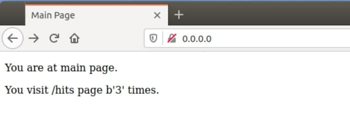
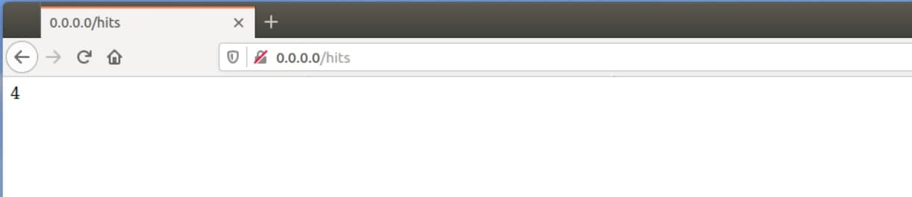
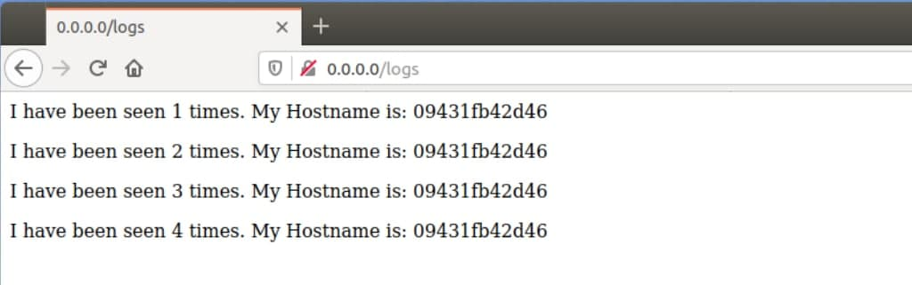

# lab 5
***
**1.** Прочитав все, що стосується "docker-compose" та бібліотеки "Flask". 
**2.** Створив папку "my_app" і папку "tests". 
**3.** Перевірив працездатність проекту за допомогою команд 
```
pipenv --python 3.8, 
pipenv install -r requirements.txt, 
pipenv run python app.py. 
```

**4.** Виникли 2 помилки. Перша полягала у "redis-server" він не був встановлений і запущений, друга полягала у відсутності папки "Logs", створив вручну і все запрацювало. 
**5.** Провів тести за допомогою команди "pipenv run pytest test_app.py --url http://localhost:5000" всі вони пройшли успішно. 
**6.** Перевірив роботу сайту та перейшов на всі його сторінки. 
**7.** Очистив середовище, після чого створив два файла "Dockerfile.app" та "Dockerfile.tests", а також "Makefile" для автоматизації процесу. 
**8.** Описую кожну директиву "Makefile": 
- REPO - змінна для зберігання назви Docker репозиторію 
- PHONY - дозволяє оголошувати фальшиві цілі 
- STATES - змінна для зберігання директив 
- run - директива для створення мережі 
- test-app - директива для запуску контейнера з моніторингом 
- docker-prune - видалення контейнерів, волюмів, мереж i імеджів 
- $(STATES) - директива для білда самого контейнера 
- docker-delete - директива для видалення імелжів 
**9.** Скрішоти сторінок сайту: 

 
 

**10**Почистив середовище.
 sudo make docker-prune
 **11**  Створив директиву для того, щоб пушити імеджі.
```
docker-push:
	@docker push $(REPO):app \
	&& docker push $(REPO):tests
```

**12** Створив дерективу для видалення імеджів.
```
images-delete:
	@sudo docker image rm --force $(shell sudo docker images -q)
```

**13** Створив docker-compose.yml.

**14** Запустив docker-compose .
```
sudo docker-compose up
```

**15** Веб сторінка добре працює з портом .
```
localhost:80
```

**16** docker-compose стоврив імеджі.


**17** Зупинив docker-compose .
```
sudo docker-compose down
```

**18** Запушив імеджі.
```
sudo docker-compose push
```

**19**На мою думку компос кращий , це новіша технологія , також він простіший у використанні і пришвидшує виконання усіх етапів. 

**20**Створив та запустив докер-компос для Lab4.Перевірив точність роботи сайту та запушив на докер репозиторій.
**21** Відредагував файл README.md.
